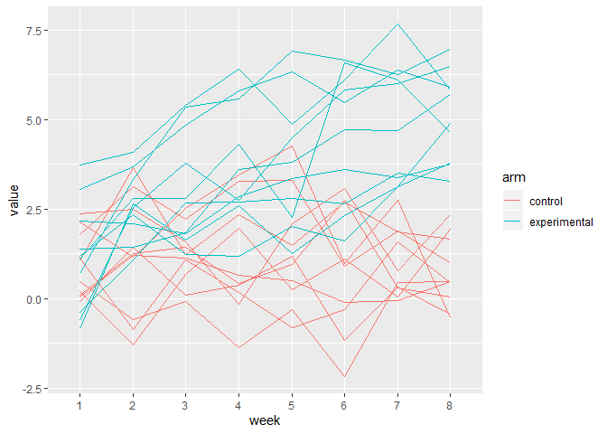

P8105 Homework 5
================
Alison Elgass

``` r
library(tidyverse)
library(dplyr)
set.seed(10)
```

# Problem 1

``` r
iris_with_missing = iris %>% 
  map_df(~replace(.x, sample(1:150, 20), NA)) %>%
  mutate(Species = as.character(Species))

fill_missing = function(vect) {
  for (i in 1:length(vect)) { #loop thru vect
    if (is.na(vect[i])) {     #if missing value found
     
      if (is.numeric(vect)) {         #case 1 - numeric
        non_miss = vect[!is.na(vect)] #select non-missing values
        vect[i] = mean(non_miss)      #set missing to mean
      } 
      
      else if (is.character(vect)) { #case 2 - char
        vect[i] = "virginica"        #set missing
      }
    }
  }
  vect
}

iris_filled = vector("list", length = 5) #empty list of 5
iris_filled = map(.x = iris_with_missing, ~fill_missing(.x))
```

# Problem 2

``` r
output = vector("list", 20)

#list out 20 full data file names
file_names = list.files(path = "./data", full.names = TRUE)

#iterate over file names, read in each
output = map(.x = file_names, ~read_csv(file = .x))

#now convert into a dataframe
trial_data = bind_rows(output) %>% 
  #add columns for subject #, study arm
  mutate(
    subject = row_number(),
    arm = if_else(
      row_number() <= 10, "control", "experimental")
  ) %>% 
  #re-arrange so subject and arm come first
  select(subject, arm, everything())

head(trial_data) #wide format
```

    ## # A tibble: 6 x 10
    ##   subject arm     week_1 week_2 week_3 week_4 week_5 week_6 week_7 week_8
    ##     <int> <chr>    <dbl>  <dbl>  <dbl>  <dbl>  <dbl>  <dbl>  <dbl>  <dbl>
    ## 1       1 control   0.2  -1.31    0.66   1.96   0.23   1.09   0.05   1.94
    ## 2       2 control   1.13 -0.88    1.07   0.17  -0.83  -0.31   1.58   0.44
    ## 3       3 control   1.77  3.11    2.22   3.26   3.31   0.89   1.88   1.01
    ## 4       4 control   1.04  3.66    1.22   2.33   1.47   2.7    1.87   1.66
    ## 5       5 control   0.47 -0.580  -0.09  -1.37  -0.32  -2.17   0.45   0.48
    ## 6       6 control   2.37  2.5     1.59  -0.16   2.08   3.07   0.78   2.35

``` r
#now pivot to long format and make a spaghetti plot
trial_data %>% 
  pivot_longer(
    week_1:week_8,
    names_to = "week",
    names_prefix = "week_",
    values_to = "value") %>% 
  ggplot(aes(x = week, y = value)) +
  geom_line(aes(group = subject, color = arm))
```

<!-- -->
